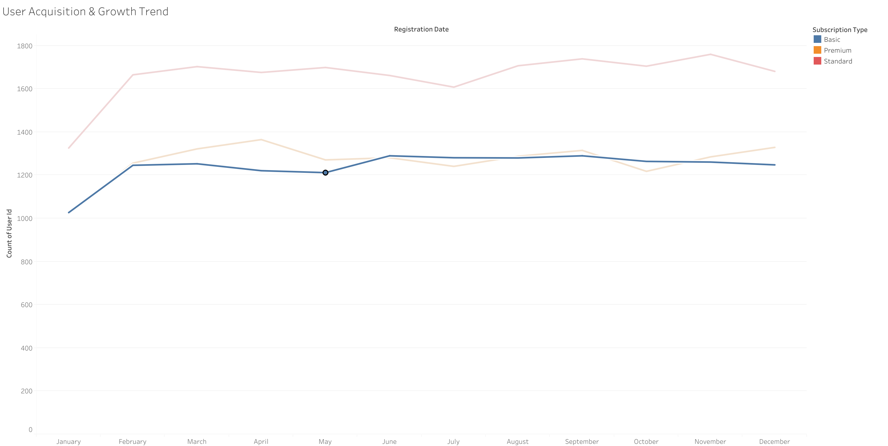
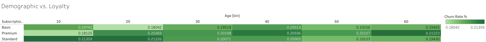
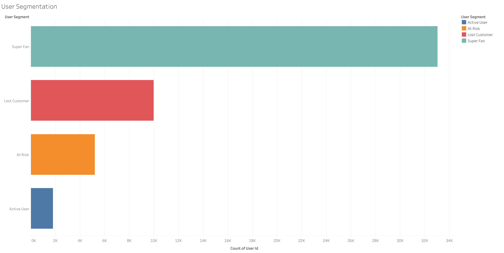
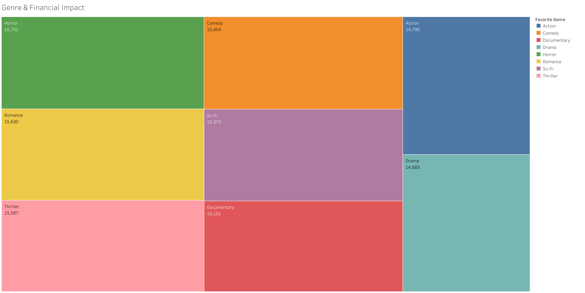
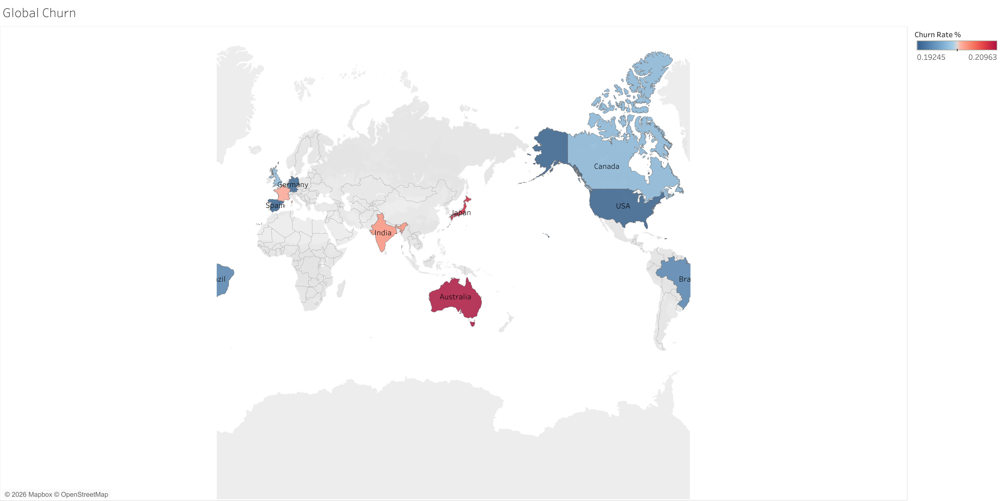

# Netflix Subscription Lifecycle & Engagement Optimization

*Case study using a synthetic user behavior dataset based on Netflix's streaming ecosystem.*

- Dataset: [Netflix User Watching Behavior Dataset](https://www.kaggle.com/datasets/rhythmghai/netflix-user-watching-behavior-dataset)  
- Tableau Dashboard: [View Interactive Dashboard](https://public.tableau.com/views/NetflixEngagementRetentionStrategySubscriptionLifecycleOptimization/GlobalChurn?:language=en-US&:sid=&:redirect=auth&:display_count=n&:origin=viz_share_link)

---

## 1. Background and Overview

In the highly competitive streaming industry, subscriber growth alone is no longer the primary metric for success. Companies must focus on retention and engagement efficiency—maximizing user lifetime value while minimizing churn risks.

This project analyzes realistic synthetic streaming data to evaluate how user demographics, content preferences, and engagement habits impact overall platform stability.

Key business questions:
- Which user segments and age groups are most prone to churn?
- How does content genre preference impact revenue loss (revenue leakage)?
- Does user engagement (watch time vs. completion) correlate with long-term loyalty?
- Are there specific geographic regions that underperform in terms of retention?

---

## 2. Data Structure Overview

The dataset contains 50,000 user records across 20 features simulating realistic streaming behavior.

### Key Dimensions:
- **Time**: account_age_months (Derived to Registration Date)
- **Geography**: country
- **Product**: subscription_type (Basic, Standard, Premium)
- **Engagement**: favorite_genre, avg_watch_time_minutes, completion_rate
- **Technical**: primary_device, devices_used, recommendation_click_rate

### Derived Metrics:
- **Registration Date**: Estimated join date based on account age.
- **Churn Rate (%)**: Percentage of users who stopped using the platform.
- **Lost Revenue**: Total monthly fee sum from churned users.
- **User Segment**: Categorization into Super Fan, Active, At Risk, and Lost Customer. 

---

## 3. Executive Summary

This analysis reveals four key findings:

1. Uniform Churn Risk: Churn rates are remarkably consistent (~20%) across all age groups and subscription tiers, suggesting that retention challenges are systemic rather than demographic-specific.
2. Healthy Core Base: The majority of the user base (66%) is classified as "Super Fans," indicating a strong product-market fit for high-engagement users.
3. Q1 Acquisition Surge: A significant spike in new user registrations occurs between January and February, highlighting the effectiveness of Q1 content releases or marketing campaigns.
4. Regional Outlier: Australia shows the highest churn risk globally, identifying a specific market that requires localized strategic intervention.

---

## 4. Insights Deep Dive

### User Acquisition & Growth Trend (Time Series)

  

Registrations show clear growth momentum at the start of the year.

**Insight:**
- Monthly registrations for the **Standard** plan jumped significantly from January (1,326) to February (1,665). Similar trends are seen in Premium and Basic plans (rising from ~1,000 to ~1,200).

**Implication:**
- Retention strategies must be aggressive immediately following the Q1 peak to maintain the new cohort.

### Demographic vs. Loyalty (Heatmap)

  

Churn rates show minimal variance across ages, ranging from 0.18042 to 0.21359.

**Insight:** 
- The highest churn points per tier are Standard users in bin 10 (0.21359), Premium users in bin 60 (0.21223), and Basic users in bin 40 (0.20013).

**Implication:** 
- While risk is distributed, targeted engagement for younger "Standard" users could provide marginal gains in retention.

### User Segmentation (Engagement Distribution)

  

The platform is heavily driven by highly engaged "Super Fans."

**Insight:** 
- **Super Fans** dominate the base with 33,025 users. Other segments include Lost Customers (9,964), At Risk (5,201), and Active Users (1,810).

**Implication:** 
- The business is stable, but the 5,201 "At Risk" users represent the immediate priority for re-activation.

### Genre & Financial Impact (Lost Revenue)

  

Revenue leakage is distributed fairly evenly across genres, totaling ~$14.6k - $15.7k per genre.

**Insight:** 
- **Horror** contributes the highest revenue loss ($15,701), while **Drama** shows the lowest ($14,683).

**Implication:** 
- Improving content quality specifically within the Horror genre audience provides the largest opportunity for revenue recovery.

### Global Churn (Geographic Analysis)

  

Churn rates are clustered globally within the 0.19245 to 0.20963 range.

**Insight:** 
- **Australia** represents the highest churn rate at 0.20963.

**Implication:** 
- Despite global consistency, the Australian market underperforms slightly, suggesting a need for localized content or pricing adjustments.

## 5. Recommendations
* **Prioritize "At Risk" Segment:** Deploy targeted automated email campaigns and personalized content recommendations for the 5,201 users in the "At Risk" segment to prevent imminent churn.
* **Audit Horror Genre Content:** Investigate the high revenue leakage in the Horror category. Improving the variety or quality of this specific genre could stabilize the largest source of financial loss.
* **Capitalize on Q1 Momentum:** Introduce "loyalty milestones" during the first 90 days for users joining in the Jan-Feb surge to lock in the annual growth.
* **Localized Strategy for Australia:** Conduct market research in the Australian region to identify competitive pressures or content gaps causing higher-than-average churn.
* **Standard Plan Optimization:** Focus on the Standard tier, as it drives the highest volume but shows significant churn among younger demographics.
